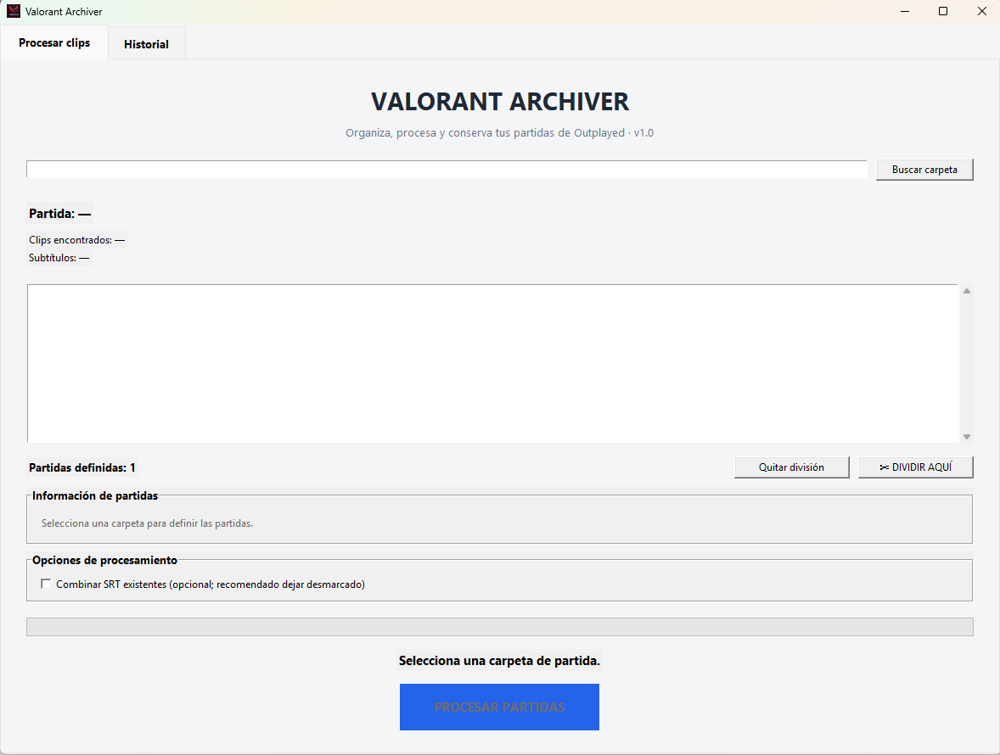
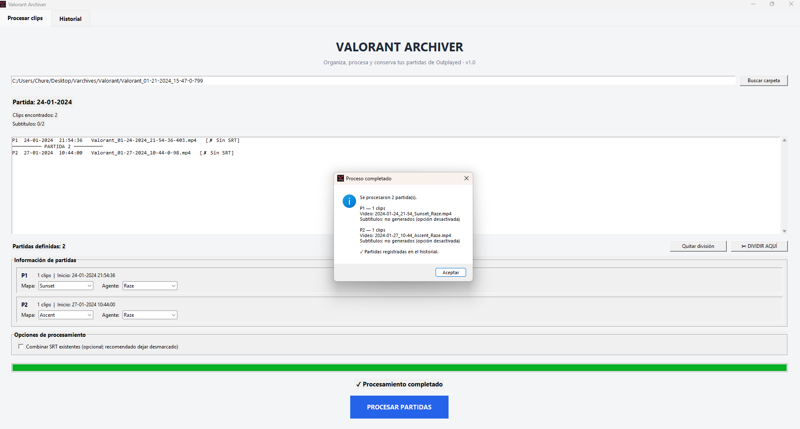
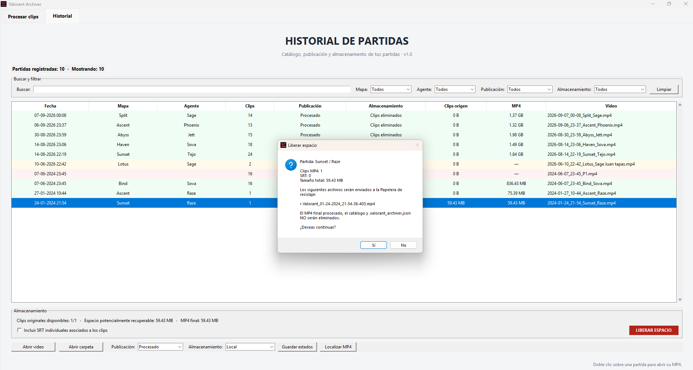

# Varchiver — Valorant Clip Archiver

**Python desktop application for organizing, merging, and cataloging Valorant gameplay clips recorded with Outplayed.**

**Status:** v1.0 stable · **Platform:** Windows · **Language:** Python 3.12 / Tkinter

[Documentación en español](README.es.md) · [Development history (Spanish)](README.es.md)

## The problem

Outplayed can save multiple matches as separate MP4 clips inside the same folder. Manually sorting clips, combining them, tracking exported videos, and freeing disk space is repetitive and error-prone.

Varchiver streamlines this workflow while keeping users in control of match boundaries and file deletion.

## Key features

- **Chronological clip organization:** reads Outplayed timestamps and handles sessions crossing midnight; a metadata-based fallback supports renamed clips.
- **Manual match segmentation:** splits a folder into multiple matches without assuming one folder equals one match.
- **Match metadata:** assigns Valorant maps and agents with searchable selectors.
- **Video processing:** combines clips into one MP4 per match using FFmpeg; optionally merges existing SRT subtitle files.
- **Persistent data:** saves per-folder match organization and maintains a searchable global processing history using JSON.
- **Storage tracking:** distinguishes publication status from local storage status and reports space used by source clips and final videos.
- **Safer cleanup:** previews the selected source files, requires confirmation, and sends them to the Windows Recycle Bin without deleting the final MP4.
- **Missing-file recovery:** lets users locate final MP4 files that have been moved or renamed.

## Tech stack

| Area | Technology |
| --- | --- |
| Desktop application | Python, Tkinter |
| Video processing | FFmpeg, FFprobe |
| Data persistence | JSON |
| Windows distribution | PyInstaller |
| Version control | Git, GitHub |
| Optional subtitle workflow | SRT, Subtitle Edit, Whisper (external tools) |

> Varchiver does not run Whisper internally. Subtitle creation and review are optional external steps.

## Workflow

1. Select an Outplayed clips folder.
2. Review chronological order and split clips into individual matches.
3. Assign a map and agent to each match.
4. Process each match into a final MP4.
5. Find exported matches in the persistent history and optionally prepare subtitles or upload to YouTube.
6. After verifying the final video, optionally send selected source clips to the Recycle Bin.

## Application Screenshots

### Main Application Interface

Desktop interface for selecting Outplayed folders,
organizing clips, and configuring processing options.

### Clip Processing and Metadata

Match segmentation, map and agent metadata,
and successful MP4 processing.

### Safe File Management

Searchable match history and confirmation dialogs
for moving source clips to the Windows Recycle Bin
while preserving the processed MP4.

## Requirements

**Running the packaged application:** Windows, access to Outplayed MP4 clips, and `ffmpeg` / `ffprobe` available on `PATH`. The packaged executable does not require a separate Python installation.

**Running from source:** Python 3.12 (or a compatible version), Tkinter, and `ffmpeg` / `ffprobe` on `PATH`. The Python source and PyInstaller specification are maintained in [`source/`](source/).

**Building a Windows executable:** install PyInstaller and run the project `.spec` file from the directory containing the source and required icon assets. See the [Spanish technical documentation](README.es.md) for the original build notes.

## Data safety

Normal processing does not alter the source MP4 or SRT files. The cleanup operation applies only to the selected match's registered source clips, presents a preview, and moves approved files to the Windows Recycle Bin. It does not empty the Recycle Bin or remove the final MP4 or JSON catalog.

## Engineering highlights

- Identified and corrected the assumption that one capture folder always contains one match.
- Designed persistent match boundaries to avoid incorrect splits when older clips are removed.
- Separated publishing state from storage state in the match catalog.
- Added a timestamp fallback for renamed clips, with the limitation that filesystem creation dates can change when files are copied.
- Validated the stable v1.0 workflow using real clips, including processing, cleanup, history persistence, and MP4 relocation.

## Scope

Varchiver is a personal project focused on **Valorant clips captured with Outplayed**. It is not a general-purpose video editor, an Outplayed replacement, or an automatic YouTube uploader.

## Project background

Developed as a personal Python automation and software-engineering project. The repository also documents a later academic GitHub Copilot exercise in which a timestamp fallback was implemented, reviewed, tested, and merged through a feature branch.

For detailed Spanish documentation and version-by-version decisions, see [README.es.md](README.es.md) .
